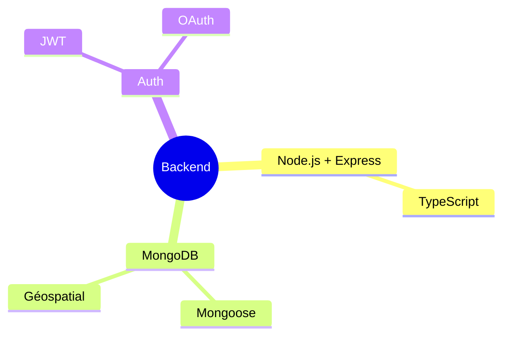
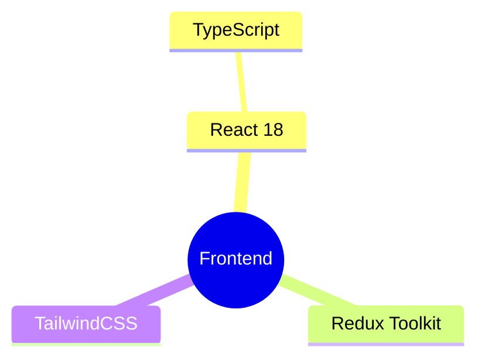
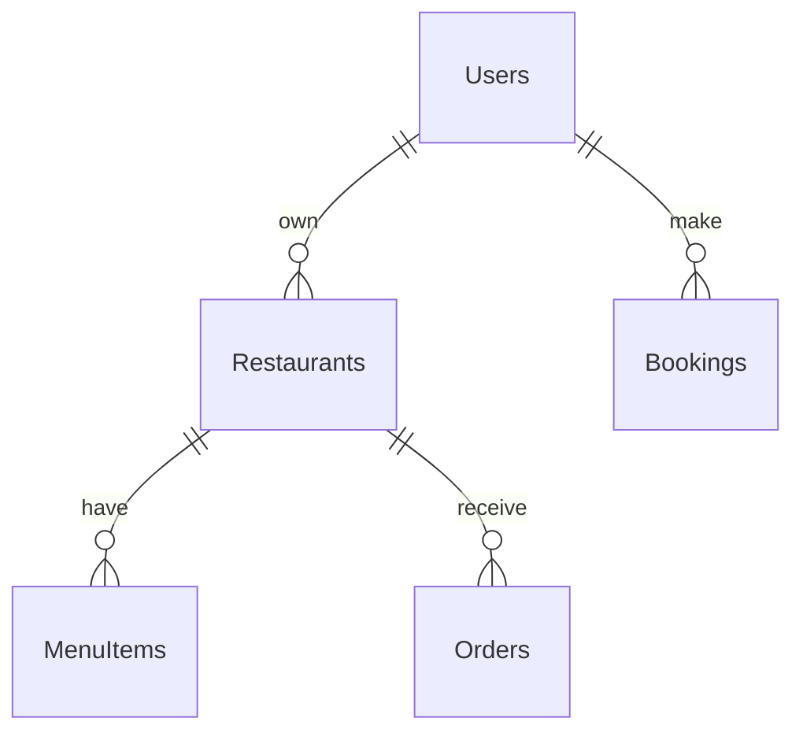

# 🍽️ Vilnius Halal & Kosher Finder

> Application moderne pour trouver, réserver et commander dans les restaurants halal, casher, végan et végétarien de Vilnius

## 🌟 Caractéristiques

### 🔐 Authentification (#7) ✅
- Inscription/Connexion JWT
- OAuth Google
- Profils utilisateurs
- Gestion des rôles

### 🔍 Recherche Avancée (#9) ✅
- Recherche full-text
- Filtres multicritères
- Géolocalisation
- Autocomplétion

### 📱 Réservation & Commande (#10) ✅
- Réservation de table
- Commande en ligne
- Suivi de livraison
- Paiement intégré

### 🥗 Options Alimentaires
- Halal ☪️
- Casher ✡️
- Végan 🌱
- Végétarien 🥬

## 📚 Documentation

- [Architecture & Flux](docs/Architecture.md)
- [API Reference](docs/API.md)
- [Modèles de Données](docs/Models.md)
- [Guide Contribution](docs/Contributing.md)

## 🔧 Stack Technique

### Backend (implémenté)

### Frontend (à venir)

## 📊 Schéma Base de Données

### Collections

## 📝 Todo
- [x] Auth JWT + OAuth (✅ Issue #7)
- [x] Recherche avancée (✅ Issue #9)
- [x] Réservation en ligne (✅ Issue #10)
- [x] Support Végan/Végétarien
- [ ] Frontend React
- [ ] PWA Integration
- [ ] Analytics

## 🤝 Contribution

Nous accueillons :
- 💻 Network Engineers
- 👀 Research Scientists  
- 🌎 Cloud Architects
- 🤖 AI/ML Specialists

## 📱 Contact

- 📧 Email: nabz0r@gmail.com
- 🐙 GitHub: [@nabz0r](https://github.com/nabz0r)

## 📄 Licence

MIT License - Innovation without Boundaries

---

**🚀 Made with ❤️ in Vilnius, Lithuania**

