# 🍽️ Vilnius Halal & Kosher Finder

> Discover and book authentic halal, kosher, vegan & vegetarian restaurants in Vilnius. Real-time availability, trusted certifications, and seamless mobile ordering

## 🌟 Caractéristiques

### 🔐 Authentification (#7) ✅
- JWT Login/Registration
- OAuth Google
- User Profiles
- Role Management

### 🔍 Advanced Search (#9) ✅
- Full-text Search
- Multi-criteria Filters
- Géolocalisation
- Autocomplete

### 📱 Booking & Orders (#10) ✅
- Table Reservations
- Online Ordering
- Delivery Tracking
- Integrated Payment

### 🥗 Dietary Options
- Halal ☪️
- Casher ✡️
- Végan 🌱
- Végétarien 🥬

## 📙 Important Links
- 📈 [Business Model](docs/BUSINESS_MODEL.md)
- 📝 [Documentation API](docs/API.md)
- 🛠️ [Guide Installation](docs/INSTALL.md)
- 📗 [Roadmap](ROADMAP.md)

## 🔧 Stack Technique

### Backend (implémenté)

```mermaid
mindmap
  root((Backend))
    Node.js + Express
      TypeScript
    MongoDB
      Mongoose
      Géospatial
    Auth
      JWT
      OAuth
```

### Frontend (à venir)

## 📊 Database Schema

### Collections

## 📝 Todo
- [x] Auth JWT + OAuth (✅ Issue #7)
- [x] Recherche avancée (✅ Issue #9)
- [x] Réservation en ligne (✅ Issue #10)
- [x] Support Végan/Végétarien
- [ ] Frontend React
- [ ] PWA Integration
- [ ] Analytics

## 🤝 Contribution

We welcome :
- 💻 Network Engineers
- 👀 Research Scientists  
- 🌎 Cloud Architects
- 🤖 AI/ML Specialists

## 📱 Contact

- 📧 Email: nabz0r@gmail.com
- 🐙 GitHub: [@nabz0r](https://github.com/nabz0r)

## 📄 Licence

MIT License - Innovation without Boundaries

---

**🚀 Made with 🇫🇷 ❤️ in Zvejotgala, Lithuania**

