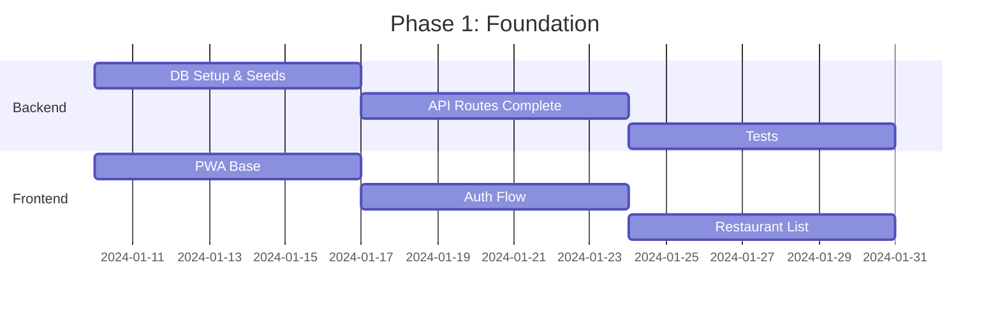

# Roadmap 

## Phase 1: Foundation 

## Phase 2: Core Features 
- Restaurant Details
- Geolocation & Maps
- Offline Support
- Search & Filters
- Reviews System

## Phase 3: Enhanced Features 
- Reservations
- Menu Management
- Push Notifications
- Analytics Dashboard
- Multiple Languages

## Phase 4: Scale & Polish 
- Performance Optimization
- SEO Enhancement
- Admin Dashboard
- Mobile Apps
- Marketing Site

## 2025 Vision
- Payment Integration
- Loyalty Program
- Business Analytics
- Delivery Integration
- Community Features

## Technical Priorities
1. [X] Auth System
2. [X] Basic Models
3. [ ] DB Config & Seeds
4. [ ] Restaurant Details
5. [ ] Geolocation
6. [ ] Offline Mode

## Current Sprint Tasks
- [ ] MongoDB Atlas Setup
- [ ] Test Data Seeds
- [ ] Restaurant Detail Page
- [ ] Maps Integration
