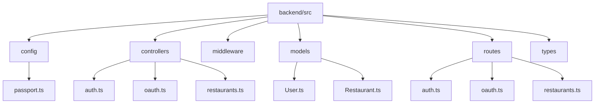
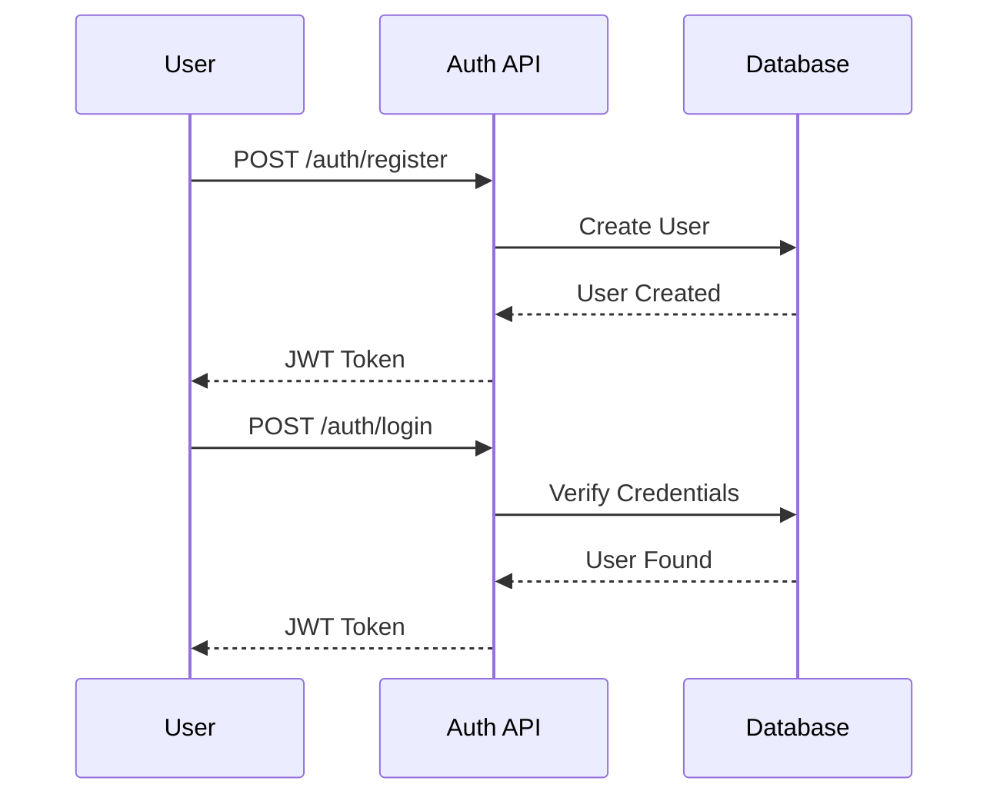
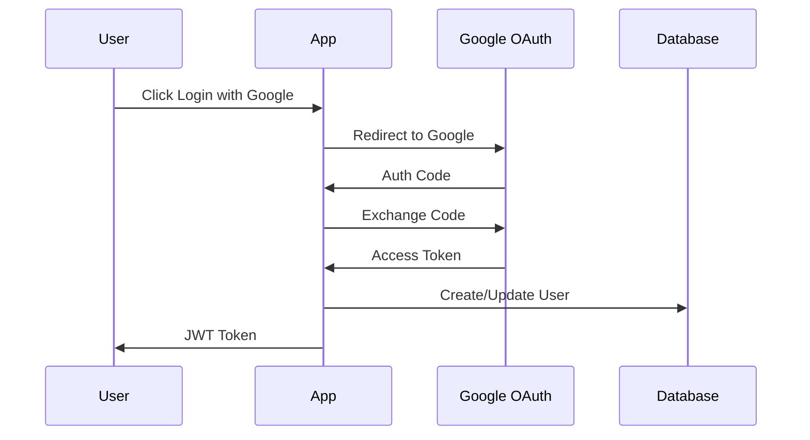

# Architecture du Projet

## Structure des Dossiers

```mermaid
graph TD
A[backend/src] --> B[config]
A --> C[controllers]
A --> D[middleware]
A --> E[models]
A --> F[routes]
A --> G[types]
B --> H[passport.ts]
C --> I[auth.ts]
C --> J[oauth.ts]
C --> K[restaurants.ts]
E --> L[User.ts]
E --> M[Restaurant.ts]
F --> N[auth.ts]
F --> O[oauth.ts]
F --> P[restaurants.ts]
```

## Flow d'Authentification

```mermaid
sequenceDiagram
    participant U as User
    participant A as Auth API
    participant D as Database
    U->>A: POST /auth/register
    A->>D: Create User
    D-->>A: User Created
    A-->>U: JWT Token
    U->>A: POST /auth/login
    A->>D: Verify Credentials
    D-->>A: User Found
    A-->>U: JWT Token
```

## Flow OAuth

```mermaid
sequenceDiagram
    participant U as User
    participant A as App
    participant G as Google OAuth
    participant D as Database
    U->>A: Click Login with Google
    A->>G: Redirect to Google
    G->>A: Auth Code
    A->>G: Exchange Code
    G->>A: Access Token
    A->>D: Create/Update User
    A->>U: JWT Token
```