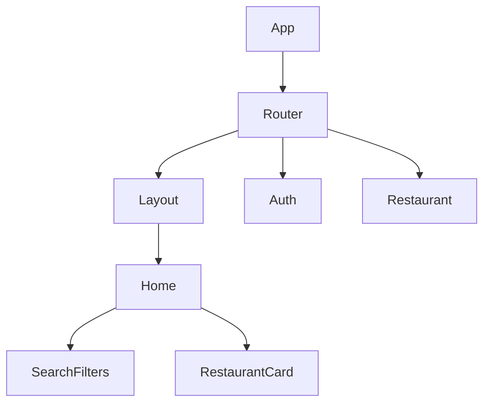
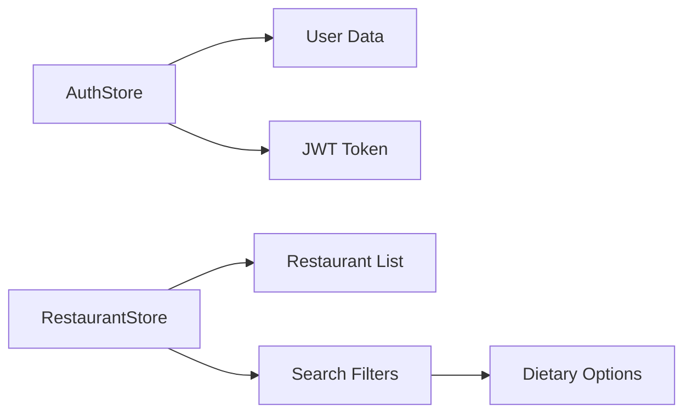

# Architecture

## Nouveaux Composants Frontend

## État Global

## Composants UI
| Composant | Description | Props |
|-----------|-------------|-------|
| SearchFilters | Filtres recherche | setFilters() |
| RestaurantCard | Carte restaurant | restaurant: Restaurant |
| ProtectedRoute | Route privée | children: ReactNode |