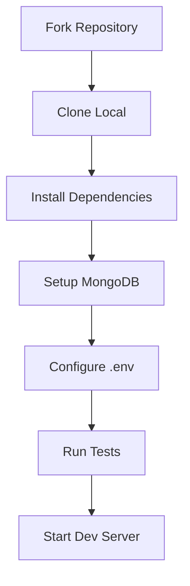

# Guide de Contribution

## Setup Développement


## Standards de Code
| Type | Standard |
|------|----------|
| Indentation | 2 espaces |
| Quotes | Single |
| Semicolons | Required |
| Naming | camelCase |
| File Naming | PascalCase |
| Max Line Length | 80 chars |

## Workflow Git
1. Create feature branch
2. Write tests
3. Implement feature
4. Run linter
5. Submit PR

## Tests
```bash
npm test        # Run all tests
npm run lint    # Check style
npm run build   # Verify build
```