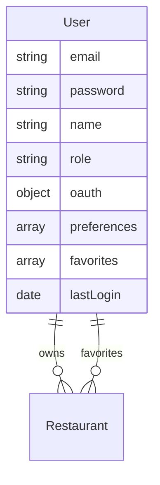
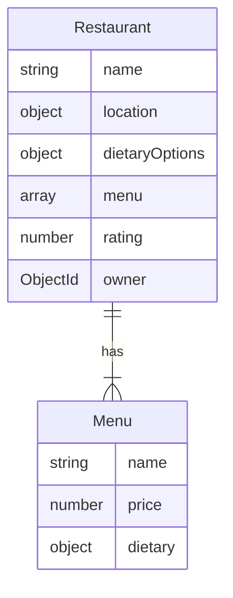

# Modèles de Données

## User

## Restaurant

### Options Diététiques
| Option | Type | Description |
|--------|------|-------------|
| halal | boolean | Certifié Halal |
| kosher | boolean | Certifié Casher |
| vegan | boolean | Pas de produits animaux |
| vegetarian | boolean | Pas de viande |